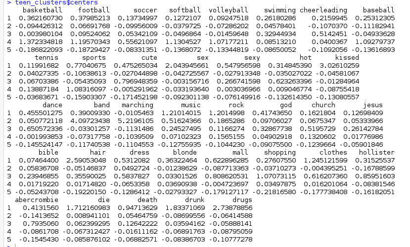

# Aplicação de Técnicas de Aprendizagem de Maquina Utilizando Software R

### - Curso ministrado pelo professor Mario Noronha Neto no Instituto Federal de Santa Catarina, campus São josé

- Livro: Brett Lantz. Machine Learning with R. Segunda edição.

- Todos os códigos neste repositório foram criados utilizando o software R Studio.

# Verificar:

- Cursera: Introdução Machine Learning - Andrew Ng
- Fazer regressão linear com o arquivo wine.csv

# Funcionamento:

- Abstração: Transformação dos dados em modelo matemático.
- Generalização: Utiliza dados abstraídos para gerar inferências generalizadas.
- Avaliação: Teste e verificação do desempenho do modelo.

### Isto envolve, na prática:

- Coleta de dados.
- Análise e preparação dos dados.
- Treinamento do modelo.
- Avaliação do modelo.
- Melhorias do modelo.

# Algoritmos vistos:

## k-nn: Classificação nearest neighbor
No treinamento, classifica conforme distância entre grupos, plotando em um plano kD os dados conforme a sua tabela, inferindo sobre as saídas específicas. Cada dado deve ser atribuido um grupo, que será resultado do experimento ao final.

Um indivíduo novo que entra é analisado através da expressão de distância:

    dist(p,q) = sqrt((p1-q1)^2 + (p2-q2)^2 .... + (pn - qn)^2)

Sabendo a distância em relação à todos os outros indivíduos do experimento, é possível saber à qual grupo o novo indivíduo pertence, assim classificando-o.

Valores mais altos para o k dão planos com maiores dimensões e criam curvas de classificação mais gerais e com mais capacidades. Entretanto aumentam a complexidade do experimento.

É necessário atribuir valores numéricos para variáveis nominais, já que o algoritmo usa distância.

A normalização dos dados pode ser feita por:

    Xn' = (Xn - min(X)/(max(X) - min(X))))

Abaixo pode ser visualizado um código com um exemplo sobre classificação e predição da característica malígna de câncer utilizando o algorítmo. Dados extraídos de https://archive.ics.uci.edu.

[Exemplo de código comentado: k-nn](exercicio1.r)

## Regressão Linear

Modelam relações complexas entre dados, estimando o impacto das variáveis no resultado de saída e extrapolando essa relação para resultados futuros generalizando para uma expressão matemática que descreve o comportamento da grandeza à ser predizida pelas n variáveis que a compõe.

Aqui serão estudadas regressões lineares, que utilizam uma reta como expressão algébrica que traduz o comportamento do experimento. Outros tipos de regressões também existem e utilizam de outras expressões matemáticas.

A regressão linear é um caso das regressões polinomiais, que traduzem um conjunto de dados em uma expressão do tipo:

    yb(x) = b0 + b1*x + b2*x^2 + ... + bn*x^n

Criando um polinomio de ordem n e encontrando os coeficientes bi que adequam a função à posição dos dados.

Na regressão linear este polinômio tem ordem = 1 de m variáveis e pode ser compreendido como uma aplicação do método dos mínimos quadrados.

Em termos gerais, pode ser compreendido por:

    y = a + b1*x1 + b2*x2 + ... + bm*xm + e0

Onde 'a' é a variável independente, 'bi' são os m coeficientes da expressão e 'e0' o resíduo do erro que a expressão gera, que deve ser mínimo.

Abaixo pode ser vizualizado um exemplo de predissão de despesas médicas utilizando o algorítimo. Dados criados pelo escritor do livro base do curso com base em dados demográficos dos EUA.

[Exemplo de código comentado: Regressão linear: Gasto em saúde anual](exercicio2.r)

[Exemplo de código comentado: Regressão Linear: Preço do vinho](exercicio3.r)

## Clustering utilizando k-means

Divide automaticamente o conjunto de dados em grupos de itens similares. Cria clusters de agrupamentos de acordo com as características de cada dado. Se baseia na semelhança de elementos próximos e distinção entre elementos não próximos. 
Algumas aplicações:

- Segmentação de clientes em grupos demográficos.
- Detecção de anomalias quando um comportamento novo não se enxaixa nos clusters conhecidos.
- Segmentação de grupos com diversas características diferentes, agrupando estas características e facilitando a análise dos dados.

Faz-se o algoritmo determinado dois pontos aleatórios (centróides) no espaço das características e determinando a distância entre cada dado (um ponto no espaço) com esses dois pontos aleatório. Depois, se calcula uma média da posição dos grupos e reposiciona a centróide. Depois, faz-se novamente a distância e refaz os passos, e isso se repete até que não acha mudança quando se refaz o cálculo da distância e da média para posição da centróide.

O exemplo à seguir trata de amostrars retiradas de 30 mil estudantes em uma rede social. Filtrando os dados, foram escolhidas 5 categorias: Atividades extracurriculares, modas, religião, romance e comportamento antissocial. 36 palavras foram escolhidas para representar estas categorias. O objetivo é separar cada indivíduo em grupos e classificar.

[Exemplo de código comentado](exemplo4.r)

Resultado extraído do exemplo:

Pode ser visto a separação dos grupos por cada característica e o quanto essas característica influencia este grupo (1-5) por quão grande o valor é.